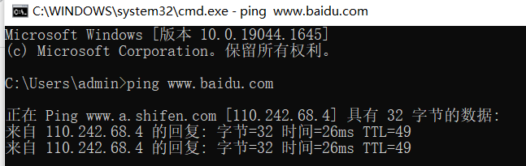
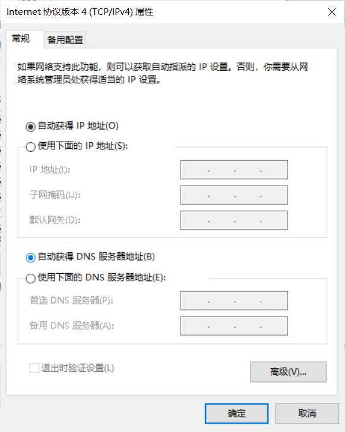
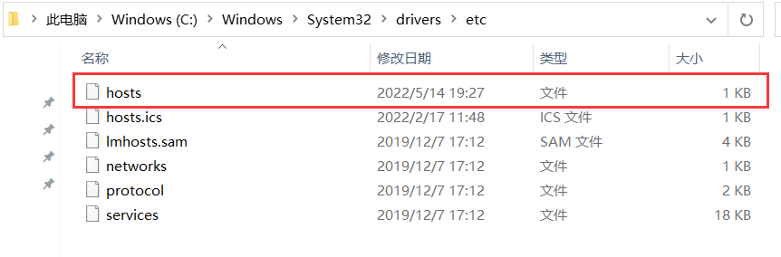
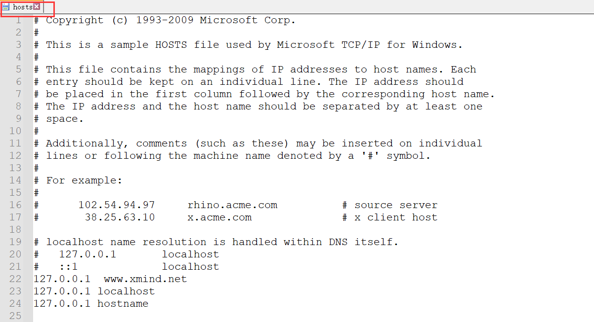
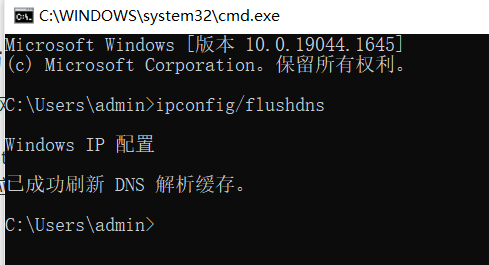

# 第一节、基础入门 #

## 01.域名
 
#### 1.什么是域名？
+ 域名的概念：
> 是由一串用点分隔的名字组成的Internet上某一台计算机或计算机组的名称，用于在数据传输时对计算机的定位标识（有时也指地理位置）。

#### 2.域名在哪里注册？

#### 3.什么是二级域名多级域名？

 **二级域名：分两种**

> 在国际顶级域名下的二级域名

国际顶级域名下二级域名， 二级域名一般是指域名注册人选择使用的网上名称，如“yahoo.com”；上网的商业组织通常使用自己的商标、商号或其他商业标志作为自己的网上名称，如“microsoft.com”。

> 国家顶级域名下二级域名

在国家顶级域名之下二级域名一般是指类似于国际顶级域名的表示注册人类别和功能的标志。例如，在“．com.cn”域名结构中，“.com”此时是置于国家顶级域名“.cn”下的二级域名，表示商业性组织，以此类推

 **多级域名**

#### 3.域名发现对于安全测试意义？
+ 可以给安全测试提供更多的测试点，方便获取更多相关信息

+ 域名对安全测试的意义：
> 
> 1.  相同的二级域名的网站架构、源码、密码可能相似
> 
> 2.  两个网站的域名解析的ip地址可能相同
> 

## 02.DNS  ###
#### 1.什么是 DNS？ ###
+ 域名系统（Domain Name System）。它是一个域名和IP地址相互映射的一个分布式数据库，能够使人更方便地访问互联网。

+ DNS使用UDP端口53。对于每一级域名长度的限制是63个字符，域名总长度则不能超过253个字符。

+ dns实现**`域名与ip地址`**的互相的转换

    

#### 2.本地 HOSTS 与 DNS 的关系？ ###
Hosts在本地将一些常用的网址域名与其对应的IP地址建立一个关联“数据库”，当我们访问域名时，***系统会首先自动从Hosts文件中寻找对应的IP地址***，一旦找到，系统会立即打开对应网页，如果没有找到，则系统会再将网址提交***DNS域名解析服务器***进行IP地址的解析。

进行钓鱼网站的攻击

在

	C:\Windows\System32\drivers\etc\hosts

为本地的hosts的地址

进行钓鱼网站的攻击

**作用机制：查找域名解析时，先看本地host文件是否有缓存，没有再去 互联网的dns服务器进行、查找域名服务器。**

修改hosts文件可以钓鱼导向为不同的网站
**`钓鱼攻击`**

#### 3.CDN 是什么？与 DNS 的关系？
CDN：是构建在数据网络上的一种分布式的内容分发网。可以提高系统的响应速度，也可以一定程度的拦截/f防御攻击。

CDN的全称是Content Delivery Network，即内容分发网络。通过中心平台的负载均衡、内容分发、调度等功能模块，使用户就近获取所需内容，降低网络拥塞，提高用户访问响应速度和命中率。-----大型网络在不同地区有不同的服务器（节点技术）。 

#### *刷新dns解析缓存* ####

    ipconfig/flushdns

#### 4.常见的 DNS 安全攻击有哪些？
+ 缓存投毒：它是利用虚假Internet地址替换掉域名系统表中的地址，进而制造破坏。

+ DNS劫持：是指在劫持的网络范围内拦截域名解析的请求，分析请求的域名，把审查范围以外的请求放行，否则返回假的IP地址或者什么都不做使请求失去响应，其效果就是对特定的网络不能访问或访问的是假网址。（针对面较广）

+ 域名劫持：域名劫持就是在劫持的网络范围内拦截域名解析的请求，分析请求的域名，把审查范围以外的请求放行，否则直接返回假的IP地址或者什么也不做使得请求失去响应，其效果就是对特定的网址不能访问或访问的是假网址。（针对面窄一点）

+ DNS DDOS攻击：通过控制大批僵尸网络利用真实DNS协议栈发起大量域名查询请求，利用工具软件伪造源IP发送海量DNS查询，发送海量DNS查询报文导致网络带宽耗尽而无法传送正常DNS查询请求。

## 03.脚本语言 ##
#### 1.常见的脚本语言类型有哪些？
asp php aspx jsp javaweb pl py cgi 等
#### 2.不同脚本类型与安全漏洞的关系？
+ 不同脚本可能爆发漏洞的可能性有所不同
+ 不同脚本漏洞的存在点可能不同，因为不同语言的适用范围不同

#### 3.漏洞挖掘代码审计与脚本类型的关系？

## 后门 ##
#### 什么是后门？有那些后门？ ####
服务器 

ape

#### 后门在安全测试中的实际意义？ ####
1.  下次更容易进入

2.  管道，提供攻击的路径

#### 关于后门需要了解那些？（玩法，免杀） ####

目的相关 
隐藏
·········
+ 免杀
+ 防止检测

## WEB ##
#### WEB 的组成架构模型？ ####
+ **网站源码**：

			分脚本类型：	PHP，java
			分应用方向:	博客类，购物网站类,论坛，社交。
				不同的类型的网站的漏洞的不同 

+ **操作系统**：windows linux
不同的平台bug的不同

+ **中间件（搭建平台）**：apache iis tomcat nginx 等
+ **数据库**：access mysql mssql oracle sybase db2 postsql 等
储存数据

#### 架构漏洞安全测试简要介绍？ ####
#### 为什么要从 WEB 层面为主为首？ ####
+ 实用性广
+ 漏洞的前提条件

## WEB 相关安全漏洞 ##
#### WEB 源码类对应漏洞 ####

	· SQL 注入
	· 上传
	· XSS
	· 代码执行
	· 变量覆盖
	· 逻辑漏洞
	· 反序列化
	
#### WEB 中间件对应漏洞 ####
未授权访问

变量覆盖

#### WEB 数据库对应漏洞 ####
弱口令，权限提升...
#### WEB 系统层对应漏洞

提权，远程代码执行权

#### 其他第三方对应漏洞

#### 第三方软件
		
#### APP 或 PC 应用结合类
逆向破解，  
网站应用
 

## 演示案例： ##

#### · 多级域名的枚举查找（原理，方式）
layer挖掘机
域名解析
下面的二级域名以及多级的域名
#### · DNS 解析修改后分析（本地或服务）
#### · EXE 后门功能及危害及类似 WEB 后门
#### · APP 类结合 WEB 协议，PC 类结合 WEB 协议

## 涉及资源： ##

  http://www.xyaz.cn

  http://www.downcc.com/soft/11196.html

  https://github.com/quasar/QuasarRAT/releases

  https://pan.baidu.com/s/13_i1ExwEaA59GfMt1Rp0Hg 提取码：0b7b

