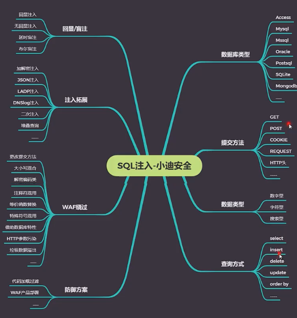
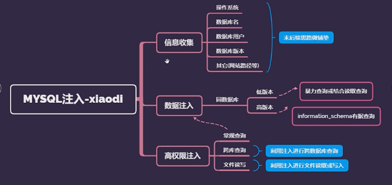
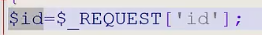
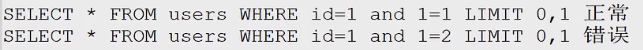
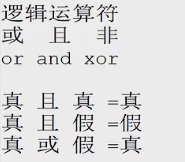
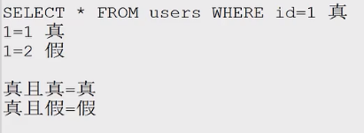
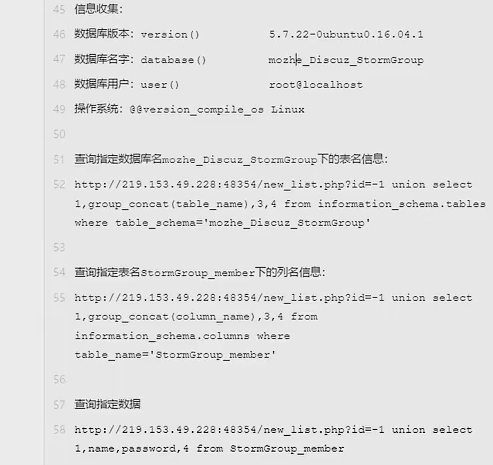

# SQL #

## MySQL注入 ###

## 1.基本命令 ###

在phpstudy的安装的目录下的MySQL的文件夹的位置

进入/bin文件夹

在此处打开cmd命令

输入

	mysql.exe -u root -p

输入数据库密码进入mysql数据库

### 命令

+ `show databases`;&nbsp;&nbsp;显示mysql中所有数据库的名称。

+ `use ***`  使用某某数据库

+ `SELECT * FROM users WHERE id=1 LIMIT 0,1`;

+ `show tables`；&nbsp;&nbsp;显示当前数据库中所有表的名称

## 2.可以注入的条件
 ###

+ 可控变量

> id值为可控的变量
> 
>定义id变量
>
>$sql="SELECT * FROM users WHERE id=$id LIMIT 0,1";
>
>id=$id  
>查找的位置为变量
>

+ 带入数据库查询

> 语句拼接后存在查询以及下一步的操作

+ 变量未存在过滤或不严谨

# 开始

 

## 1.注入点的判断 ##
##### 方法一：
and 1=1  正常

and 1=2  错误

则该处存在注入点

##### 方法二：

`select * from users where id=1 limit 0,1 `
正常

`select * from users where id=1asdfgh limit 0,1`
 异常

则id存在注入点

##### 方法一：

    `?id=1 and 1=1`
    `?id=1 and 1=2`
页面出现不同的情况且and 1=2 出现错误

存在注入点

##### 方法二
    `?id=1fbjksdfh`
在后面输入错误的字符，页面发生变化
则存在注入点

## 2.判断注入 ##
### 猜解列名数量（字段数）

    order by x 

错误与正常的正常值

> .php/?id=1 order by 1
> 
> .php/?id=1 order by 2
> 
> .php/?id=1 order by 3
> 
> .php/?id=1 order by 4

### 报错猜解准备
> .php/?id=1 union select 1,2,3,4

> .php/?id=-1 union select 1,2,3,4
>     
    id=-1 and 2=3

## 3.信息收集
- 数据库版本
    `version()`

- 数据库名字
 `database()`

- 数据库用户
`user()`
- 操作系统 
   `@bersion_compile_os`

#### 备注： ####

  1.在MySQL5.0以上版本的数据库中，mysql自带一个数据库名 `information_schema` 是一个存储记录所有的数据库名，表名，列名的数据库

可以通过他查询获取指定数据库下面的表名和列名信息

2.
数据库中

	.
	
代表下一级

例如
*xiao.user 代表xiao数据库下的usesr表名、
user.bge  代表user表下面的列名*

### 重要的信息 

1. 记录所有的表名的表

	`information_schema.tables`

1. 记录所有的列名的表
	`information_schema.columns`
1. 表名

	`table_name`

1. 列名 

	`column_name`
 
 

 

数据注入

  
 
### root与非root的情况 ####

MySQL数据库A
MySQL数据库B
MySQL数据库C

**MySQL数据库D = 网站D =数据库用户D
→** 
> 1. **表名**
> 1. **列名**
> 1. **数据**

**
*数据库D = 网站D =数据库用户D***
若将网站部署在root用户上

root 注入点

则A网站出现漏洞时，则其他网站也能受到攻击

跨站注入

记录数据库名

`informmation_schema` 

获取所有的数据库名
  

# 合天网安 #

