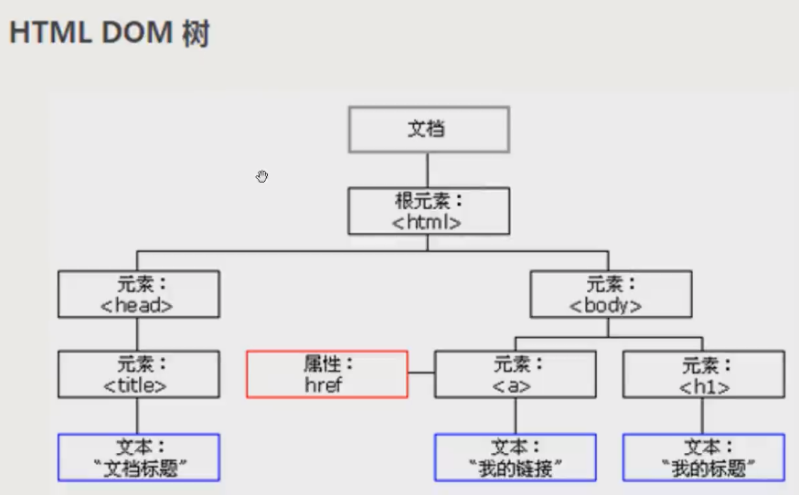

#第25天 xss跨站注入 #

***XSS跨站之原理分类及攻击手法***

## 原理

#### 漏洞产生的原理（本质 ）

`js脚本`代码 

前端方面

函数类型

浏览器内核版本
防止过滤

 
### 分类 ###

- 反射型（持续型）
- 存储型（非持续型）
- DOM型
 

## 1.反射型 ##

	

———————————————

	#`onclick="alert(2)">

## 2.存储型  ##

## 3.DOM型 
dom树

触发地址链接

反射型

值的

## 区别 ##

**反射型**

+ 发包

+ 传参

到php
然后回包

**
存储型**

发包 
传参

 
写入数据库里的表

数据写入数据库

回显

**dom型
**

发包 存储到本地的静态前端代码

前端的js处理完毕

在js代码端处理

与后端的php不处理

（文件上传的js过滤）

与后端的数据库无关

网页传参
 带入执行

后端语言处理

dom型是js的
代码处理
 

dom属于一种反射型

使用跨站脚本控制页面显示的内容

跨站语句

## cookie ####

cookie

**用户的凭据**；通过凭据判断对方身份

保存cookie的时间
（管理员的cookie）

+ 对方有bug
+ 浏览器没阻止
+ 未登陆后台
+ 浏览器未保存
+ 对方的保护（代码过滤，http-only)
+ 对方不触发bug
+         

session 
存储服务器  
存活的时间较短
大型的项目
较为安全

cookie

存储在本地
存活的时间长
小中型
 

session失效

  
`sqli-libs cookie注入`

## 实例 ##

绕过script过滤

	<BOOY onload="alert('xss')">

盗取cookie

登录管理员页面

啊

####xss平台

**
分类
**

**
手法
**

